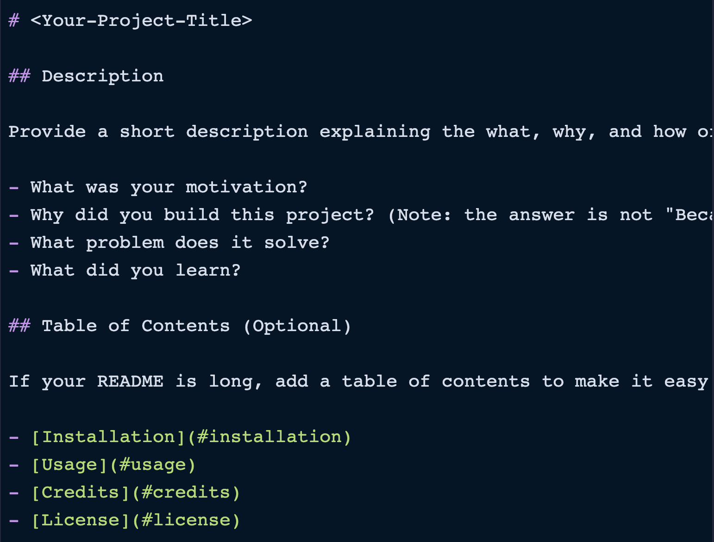

# ReadME-Generator 

## Description
The purpose of this project was to create a command-line application that dynamically generates a professional README.md file from a user's input using the Inquirer package.

## Table of Contents 
* [Usage](#usage)
* [Questions](#questions)

## Usage 
The  Git Hub Repo [URL](https://github.com/AlizaSharma/readme-generator). 

See example below of expected outcome:

## Questions 
If questions arise on the project, please contact alize.sharma12@gmail.com. 

